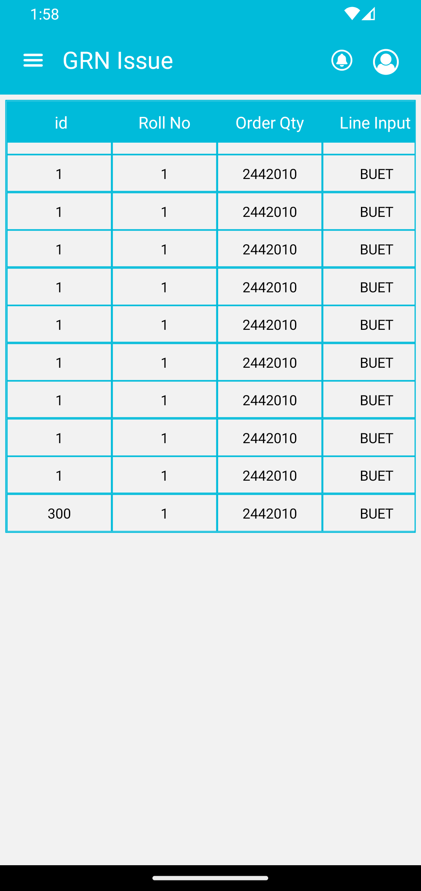

# react-native-fancy-table

React Native Scrollable,Dynamic, Responsive Data table view horizontal and vertical.:point_left::point_left::point_left::point_left::sparkling_heart::sparkling_heart::sparkling_heart: :v::v::v:

|  |  |  |
| ---------------------------------- | ---------------------------------- | ---------------------------------- |

## Installation

Using Yarn:

```sh
yarn add react-native-fancy-table
```

```sh
npm install react-native-fancy-table
```

## Usage

```js
import * as React from 'react';
import { StyleSheet, Text, View } from 'react-native';
import FancyTable from 'react-native-fancy-table';

export default function App() {
  const header = [
    ' id',
    'Roll No',
    'Order Qty',
    'Line Input',
    'Line Balalance',
    'Production',
    'Sample',
    'Killed',
    'Missing',
    'Buy Date',
    'Ship Date',
    'Proto No',
    'Set Code',
    'Destination Place',
    'Delivery Place',
    'Item Number',
  ];
  const tableBody = [
    {
      id: 1,
      RollNo: '1',
      Pdm_ItemCode: '2442010',
      description: ' BUET',
      LotNo: 'N23060829',
      UOM: 'YDS',
      RollQty: 55,
      RollWidth: '153cm',
      RollColor: 'DKT N07A BLACK',
      RollShrinkageWarp: '',
      RollshrinkageWeft: '',
      SupplierId: 380,
      supplier: '',
      ItemId: 0,
      item: 'Fabric',
      consignment: '3333',
    },
    {
      id: 1,
      RollNo: '1',
      Pdm_ItemCode: '2442010',
      description: ' BUET',
      LotNo: 'N23060829',
      UOM: 'YDS',
      RollQty: 55,
      RollWidth: '153cm',
      RollColor: 'DKT N07A BLACK',
      RollShrinkageWarp: '',
      RollshrinkageWeft: '',
      SupplierId: 380,
      supplier: '',
      ItemId: 0,
      item: 'Fabric',
      consignment: '3333',
    },
  ];

  return (
    <>
      <FancyTable
        headerBGColor="silver"
        headerFontColor="white"
        headerFontSize={15}
        bodyFontSize={13}
        bodyFontColor="black"
        tableHeight={1.4}
        header={header}
        tableBody={tableBody}
        rowWidth={4}
        borderColor="gray"
        borderWidth={1}
      />
    </>
  );
}
```

## Properties
| Prop              | Type  | Description | Default |
|---|---|---|---|
| <b>header</b>     | Array[] | Table header you could use array data as single string. | `null` |
| <b>tableBody</b>  | Array[] | Table data you could use as array of object, key value pare. | `null` |
| <b>headerBGColor</b>      | String | Header background color | `white` |
| <b>headerFontColor</b>| String| Table header font color. | `black` |
| <b>headerFontSize</b>  | Number | header font size. | `16` |
| <b>bodyFontSize</b>    | Number | Body font size. | `14` |
| <b>bodyFontColor</b>   | String | Body font color.| `[]` |
| <b>tableHeight</b>  | Number | Reverse table height resizer. | `4` |
| <b>rowWidth</b>   | Number   | Increment row with by reverse order   |   4  |
| <b>borderColor</b> | String | Table border color | `gray` |
| <b>borderWidth</b> | Number | Table border width | `1` |

## Contributing

See the [contributing guide](CONTRIBUTING.md) to learn how to contribute to the repository and the development workflow.

## License

MIT

---

Made with [create-react-native-library](https://github.com/callstack/react-native-builder-bob)
